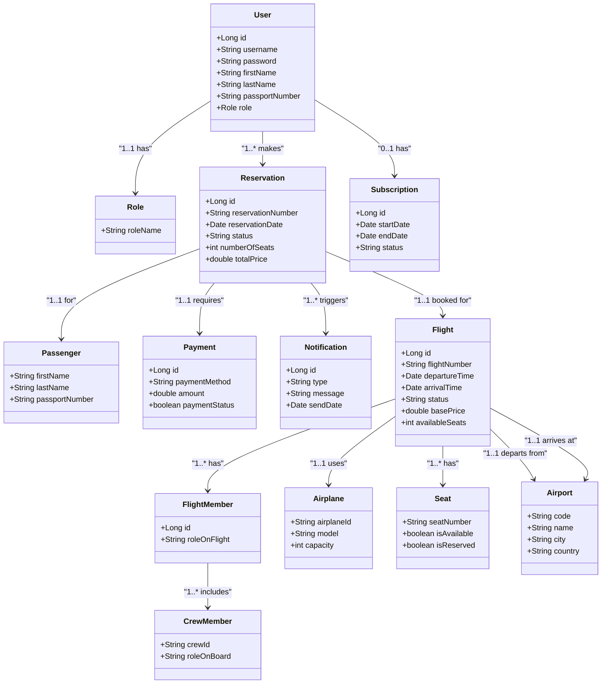

```mermaid 
    classDiagram
    %% Classes
    class Role {
        +String roleName
    }

    class User {
        +Long id
        +String username
        +String password
        +String firstName
        +String lastName
        +String passportNumber
        +Role role

    }

    class Passenger {
        +String firstName
        +String lastName
        +String passportNumber
    }

    class Reservation {
        +Long id
        +String reservationNumber
        +Date reservationDate
        +String status
        +int numberOfSeats
        +double totalPrice
    }

    class Payment {
        +Long id
        +String paymentMethod
        +double amount
        +boolean paymentStatus
    }

    class Notification {
        +Long id
        +String type
        +String message
        +Date sendDate
    }

    class Subscription {
        +Long id
        +Date startDate
        +Date endDate
        +String status
    }

    class Flight {
        +Long id
        +String flightNumber
        +Date departureTime
        +Date arrivalTime
        +String status
        +double basePrice
        +int availableSeats
    }

    class FlightMember {
        +Long id
        +String roleOnFlight
    }

    class Airplane {
        +String airplaneId
        +String model
        +int capacity
    }

    class Seat {
        +String seatNumber
        +boolean isAvailable
        +boolean isReserved
    }

    class Airport {
        +String code
        +String name
        +String city
        +String country
    }

    class CrewMember {
        +String crewId
        +String roleOnBoard
    }

    %% Relationships

    User --> Role : "1..1 has"
    User --> Reservation : "1..* makes"
    Reservation --> Passenger : "1..1 for"
    Reservation --> Payment : "1..1 requires"
    Reservation --> Notification : "1..* triggers"
    Reservation --> Flight : "1..1 booked for"
    Flight --> Airplane : "1..1 uses"
    Flight --> Seat : "1..* has"
    Flight --> Airport : "1..1 departs from"
    Flight --> Airport : "1..1 arrives at"
    Flight --> FlightMember : "1..* has"
    FlightMember --> CrewMember : "1..* includes"
    User --> Subscription : "0..1 has"
```